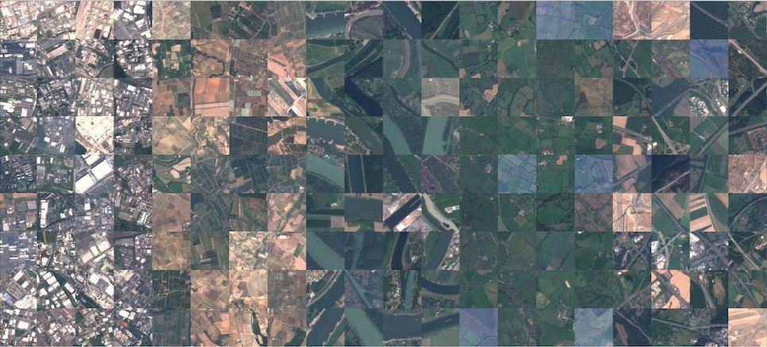

# Saving and Loading Models with EuroSAT

A CNN that classifies satellite images into 10 land use / land cover classes, built with
TensorFlow 2 / Keras, with a focus on checkpointing and reloading weights during training.


## Overview

This project builds a small CNN for satellite image classification, but the real focus is on
**saving and loading models**: checkpointing weights every epoch, keeping only the best
checkpoint according to validation accuracy, and stopping training early once it stops
improving.

The model reaches **71.6% accuracy on the test set** by reloading the weights from its best
epoch (34), 2.8 points above the accuracy obtained from the last epoch of training (37).

Everything lives in a single notebook:
[`tf2-transfer-learning-eurosat.ipynb`](tf2-transfer-learning-eurosat.ipynb)

## Dataset



The [EuroSAT dataset](https://github.com/phelber/EuroSAT), Sentinel-2 satellite images labelled
by land use and land cover:

|  |  |
|---|---|
| Training set | 4,000 images (subset) |
| Test set | 1,000 images (subset) |
| Image format | 64x64 RGB, pixel values 0-255 |
| Classes | AnnualCrop, Forest, HerbaceousVegetation, Highway, Industrial, Pasture, PermanentCrop, Residential, River, SeaLake |
| Task | multi-class image classification |

Preprocessing is minimal: pixel values are scaled to the `[0, 1]` range. No channel dimension
needs to be added, since the images are already RGB.

> `data/x_train.npy` and `data/x_test.npy` are not included in this repository (390+ MB
> combined). See [Getting started](#getting-started) below.

## Model

A small `Sequential` CNN:

| Layer | Configuration | Output shape | Params |
|-------|---------------|--------------|--------|
| `Conv2D` | 16 filters 3x3, `padding="same"`, ReLU | (64, 64, 16) | 448 |
| `Conv2D` | 8 filters 3x3, `padding="same"`, ReLU | (64, 64, 8) | 1,160 |
| `MaxPooling2D` | 8x8 | (8, 8, 8) | 0 |
| `Flatten` | - | (512,) | 0 |
| `Dense` | 32 units, ReLU | (32,) | 16,416 |
| `Dense` | 10 units, softmax | (10,) | 330 |

Total: 18,354 trainable parameters. Compiled with Adam and
`sparse_categorical_crossentropy` as the loss function.

## Workflow

1. **Load and preprocess** — scale pixel values to `[0, 1]`.
2. **Build the model** — two convolutional layers plus a small dense classifier.
3. **Baseline** — test accuracy with the freshly initialized weights, before any training.
4. **Checkpoints** — three callbacks: `ModelCheckpoint` (every epoch), `ModelCheckpoint`
   (`save_best_only=True`, monitoring `val_accuracy`), and `EarlyStopping` (`patience=3`).
5. **Train** — up to 50 epochs, stopped early once validation accuracy stalls.
6. **Reload and compare** — a fresh model instance loaded with the last-epoch weights, and
   another loaded with the best-epoch weights, evaluated side by side on the test set.

## Results

| Weights used | Test accuracy |
|---|---|
| Randomly initialized | 11.2% |
| Last epoch (37) | 68.8% |
| Best epoch (34) | **71.6%** |

Training was stopped by `EarlyStopping` at epoch 37, three epochs after validation accuracy
last improved, at epoch 34 (71.6%).

## Key takeaways

- **The last epoch is not always the best epoch.** Validation accuracy oscillated in the final
  epochs of training; the checkpoint from epoch 34 outperformed the one from epoch 37 by 2.8
  points.
- **`save_best_only` is what actually protects the result.** Without it, the model saved at the
  end of training would have been a worse version than one seen a few epochs earlier.
- **Early stopping saves time, not just accuracy.** Training was capped at 50 epochs but
  stopped automatically at 37, once 3 epochs went by without improvement.
- **Freshly initialized weights are close to random chance**, as expected: 11.2% against a
  ~10% baseline for 10 balanced classes.

## Project structure

```
.
├── data/                         # Sample image + labels (x_train/x_test.npy not tracked)
├── models/                       # Saved final model (EuroSatNet.h5)
├── checkpoints_every_epoch/      # One checkpoint per training epoch
├── checkpoints_best_only/        # Single checkpoint, best val_accuracy
├── src/tf2_transfer_learning_eurosat/  # Package scaffold
├── tf2-transfer-learning-eurosat.ipynb # Main notebook
├── pyproject.toml                # Dependencies (uv project)
└── uv.lock                       # Pinned versions
```

## Getting started

The project is managed with [uv](https://docs.astral.sh/uv/) and requires Python 3.11+.

```bash
# Clone the repository
git clone https://github.com/ramirezgrosas/tf2-transfer-learning-eurosat.git
cd tf2-transfer-learning-eurosat

# Create the virtual environment and install the dependencies
uv sync
```

`x_train.npy` and `x_test.npy` are not included in the repo. Get the EuroSAT `.npy` arrays used
in this notebook (or an equivalent subset) and place them in `data/` before running the
notebook:

```
data/x_train.npy
data/y_train.npy
data/x_test.npy
data/y_test.npy
```

Then open the notebook in VS Code and select `.venv` as the kernel, or launch Jupyter directly:

```bash
uv run --with jupyter jupyter lab
```

Main dependencies: TensorFlow 2.21 (Keras 3.15), NumPy, pandas and matplotlib.

## Possible improvements

- Train on the full EuroSAT dataset (27,000 images) instead of the 5,000-image subset.
- Add data augmentation, since satellite images have no fixed orientation.
- Try transfer learning from a pretrained network (e.g. MobileNetV2) instead of training from
  scratch.
- Build a confusion matrix to see which land use classes get confused with each other.

## Author

**Diego Ramírez Rosas** — [ramirezgrosas](https://github.com/ramirezgrosas)
